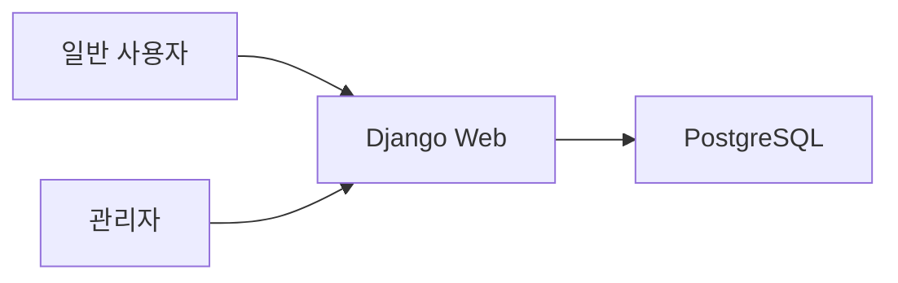
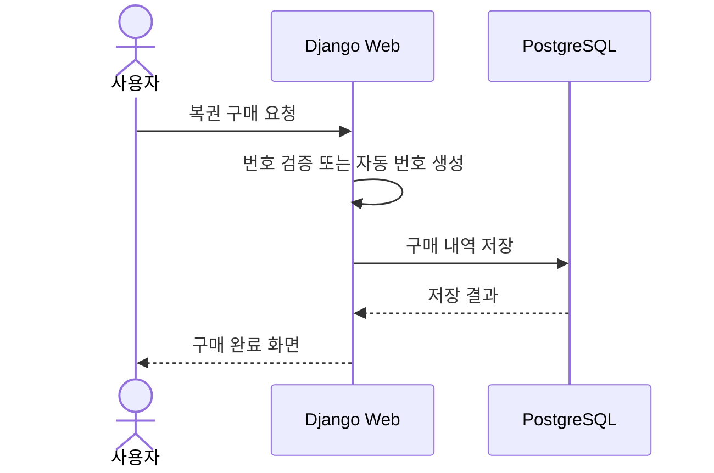
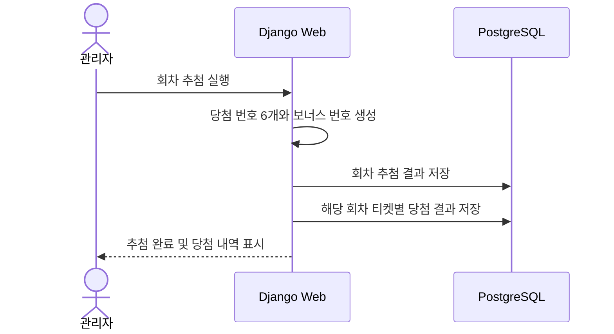
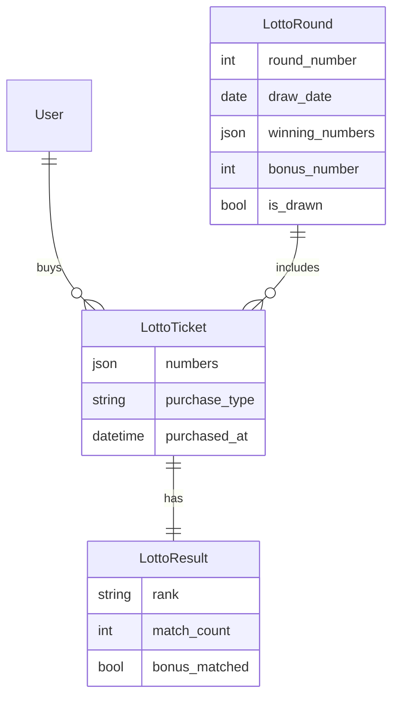
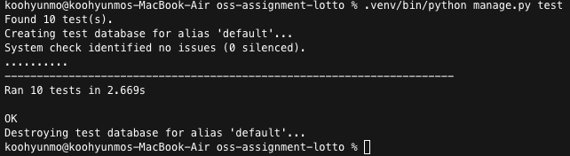
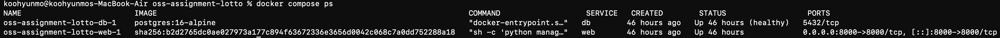
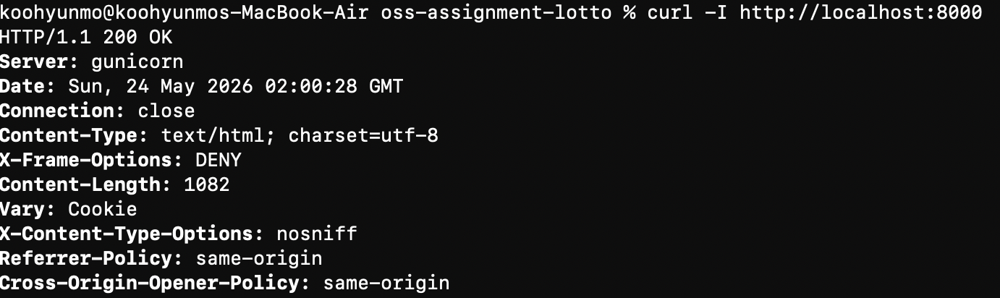

# 6/45 Lotto 웹 사이트 개발 보고서

## 1. 프로젝트 개요

Django와 Docker를 사용하여 6/45 Lotto 웹 사이트를 구현했다. 일반 사용자는 복권을 구매하고 당첨 결과를 확인할 수 있으며, 관리자는 판매 내역과 당첨 내역을 확인하고 회차 추첨을 실행할 수 있다.

## 2. 요구사항 분석

- 일반 사용자 기능
  - 수동 번호 복권 구매
  - 자동 번호 복권 구매
  - 구매 내역 조회
  - 당첨 확인
- 관리자 기능
  - 판매 내역 확인
  - 추첨 기능
  - 당첨 내역 확인
- 환경 요구사항
  - Docker 기반 multi-container 구성
  - 소스 코드 GitHub 링크 보고서 명시

## 3. 시스템 설계



### 3.1 요청 흐름



### 3.2 추첨 흐름



## 4. Docker 구성

`docker-compose.yml`은 다음 2개 컨테이너로 구성했다.

- `web`: Django 애플리케이션 실행
- `db`: PostgreSQL 데이터베이스

`web` 컨테이너는 `db` healthcheck 완료 후 migration, static collect, Gunicorn 실행을 수행한다.

Docker 실행 상태와 웹 서버 응답은 테스트 결과 섹션의 캡처로 확인할 수 있다.

## 5. DB 설계

- `LottoRound`
  - 회차, 추첨일, 당첨 번호, 보너스 번호, 추첨 완료 여부
- `LottoTicket`
  - 구매자, 회차, 구매 번호, 수동/자동 여부, 구매일
- `LottoResult`
  - 티켓, 등수, 일치 번호 수, 보너스 일치 여부



## 6. 주요 화면 및 URL

| 구분 | URL | 설명 |
| --- | --- | --- |
| 메인 | `/` | 현재 회차와 최근 당첨 번호 표시 |
| 회원가입 | `/signup/` | 일반 사용자 계정 생성 |
| 로그인 | `/accounts/login/` | 사용자 로그인 |
| 복권 구매 | `/tickets/buy/` | 수동 번호 구매 화면 |
| 자동 구매 | `/tickets/auto/` | 자동 번호 구매 처리 |
| 내 복권 | `/tickets/` | 사용자 구매 내역 |
| 당첨 확인 | `/results/` | 사용자 당첨 결과 |
| 관리자 대시보드 | `/manager/` | 판매 내역, 추첨, 당첨 내역 |
| 추첨 실행 | `/manager/rounds/<id>/draw/` | 관리자 추첨 처리 |

## 7. 구현 과정

1. Django 프로젝트와 `lotto` 앱을 생성했다.
2. PostgreSQL 환경 변수를 지원하도록 설정을 구성했다.
3. Dockerfile과 Docker Compose로 multi-container 실행 환경을 구성했다.
4. 로또 번호 검증, 자동 번호 생성, 당첨 판정 로직을 `services.py`에 구현했다.
5. 일반 사용자 화면과 관리자 대시보드를 Django Template 기반으로 구현했다.
6. Django Admin에서 회차, 티켓, 결과를 관리할 수 있도록 등록했다.
7. `create_next_round` 관리 명령으로 초기 회차를 쉽게 생성할 수 있도록 했다.
8. `.dockerignore`를 추가하여 Docker 빌드 컨텍스트에서 가상환경, 캐시, 로컬 DB를 제외했다.

## 8. 테스트 결과

테스트 명령:

```bash
.venv/bin/python manage.py test
```

검증 항목:

- 자동 번호 생성 범위와 중복 여부
- 수동 번호 구매 검증
- 추첨 후 결과 계산
- 당첨 등수 판정
- 일반 사용자와 관리자 권한 분리

테스트 실행 결과는 다음 캡처와 같다.



Docker 컨테이너 실행 상태는 다음 캡처와 같다.



웹 서버 응답 확인 결과는 다음 캡처와 같다.



## 9. 실행 방법

```bash
cp .env.example .env
docker compose up --build
```

관리자 계정 생성:

```bash
docker compose exec web python manage.py createsuperuser
```

첫 회차 생성:

```bash
docker compose exec web python manage.py create_next_round
```

## 10. GitHub 링크

소스 코드는 아래 GitHub 저장소에 업로드했다.

- GitHub: https://github.com/hmooko/oss-assignment-lotto

