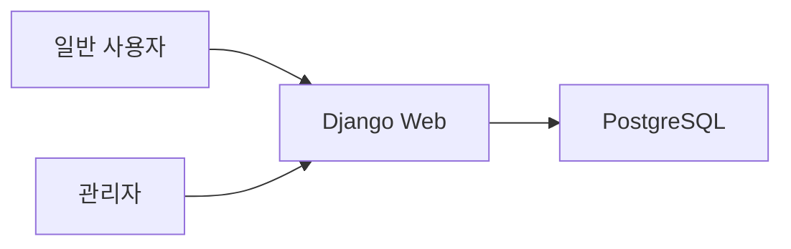

# 6/45 Lotto 웹 사이트 개발 보고서

## 1. 프로젝트 개요

Django와 Docker를 사용하여 6/45 Lotto 웹 사이트를 구현했다. 일반 사용자는 복권을 구매하고 당첨 결과를 확인할 수 있으며, 관리자는 판매 내역과 당첨 내역을 확인하고 회차 추첨을 실행할 수 있다.

## 2. 요구사항 분석

- 일반 사용자 기능
  - 수동 번호 복권 구매
  - 자동 번호 복권 구매
  - 구매 내역 조회
  - 당첨 확인
- 관리자 기능
  - 판매 내역 확인
  - 추첨 기능
  - 당첨 내역 확인
- 환경 요구사항
  - Docker 기반 multi-container 구성
  - 소스 코드 GitHub 링크 보고서 명시

## 3. 시스템 설계



## 4. Docker 구성

`docker-compose.yml`은 다음 2개 컨테이너로 구성했다.

- `web`: Django 애플리케이션 실행
- `db`: PostgreSQL 데이터베이스

`web` 컨테이너는 `db` healthcheck 완료 후 migration, static collect, Gunicorn 실행을 수행한다.

## 5. DB 설계

- `LottoRound`
  - 회차, 추첨일, 당첨 번호, 보너스 번호, 추첨 완료 여부
- `LottoTicket`
  - 구매자, 회차, 구매 번호, 수동/자동 여부, 구매일
- `LottoResult`
  - 티켓, 등수, 일치 번호 수, 보너스 일치 여부

## 6. 구현 과정

1. Django 프로젝트와 `lotto` 앱을 생성했다.
2. PostgreSQL 환경 변수를 지원하도록 설정을 구성했다.
3. Dockerfile과 Docker Compose로 multi-container 실행 환경을 구성했다.
4. 로또 번호 검증, 자동 번호 생성, 당첨 판정 로직을 `services.py`에 구현했다.
5. 일반 사용자 화면과 관리자 대시보드를 Django Template 기반으로 구현했다.
6. Django Admin에서 회차, 티켓, 결과를 관리할 수 있도록 등록했다.
7. `create_next_round` 관리 명령으로 초기 회차를 쉽게 생성할 수 있도록 했다.

## 7. 테스트 결과

테스트 명령:

```bash
python manage.py test
```

검증 항목:

- 자동 번호 생성 범위와 중복 여부
- 수동 번호 구매 검증
- 추첨 후 결과 계산
- 당첨 등수 판정
- 일반 사용자와 관리자 권한 분리

실행 결과:

```text
Ran 10 tests in 2.790s

OK
```

## 8. 실행 방법

```bash
cp .env.example .env
docker compose up --build
```

관리자 계정 생성:

```bash
docker compose exec web python manage.py createsuperuser
```

첫 회차 생성:

```bash
docker compose exec web python manage.py create_next_round
```

## 9. GitHub 링크

제출 전 GitHub 저장소 URL을 아래에 기입한다.

- GitHub: `TODO`

## 10. 개선점

- Nginx 컨테이너 추가를 통한 정적 파일 서빙 분리
- 회차 자동 생성 스케줄러 추가
- 당첨 금액 계산 기능 추가
- 사용자별 구매 수량 제한 기능 추가
